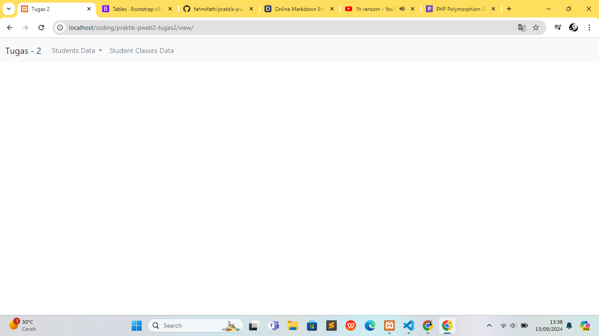
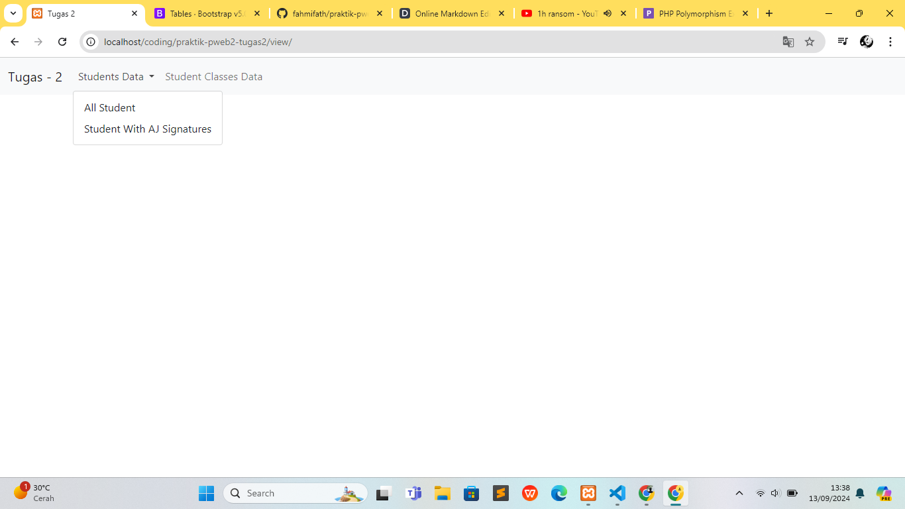
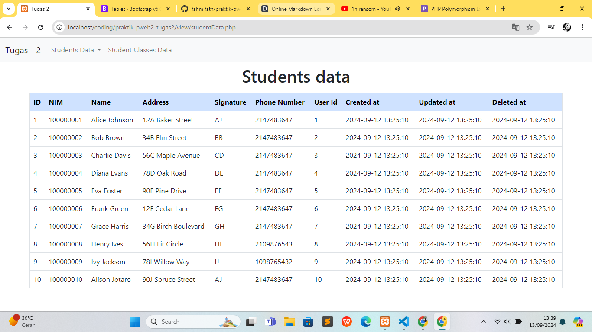
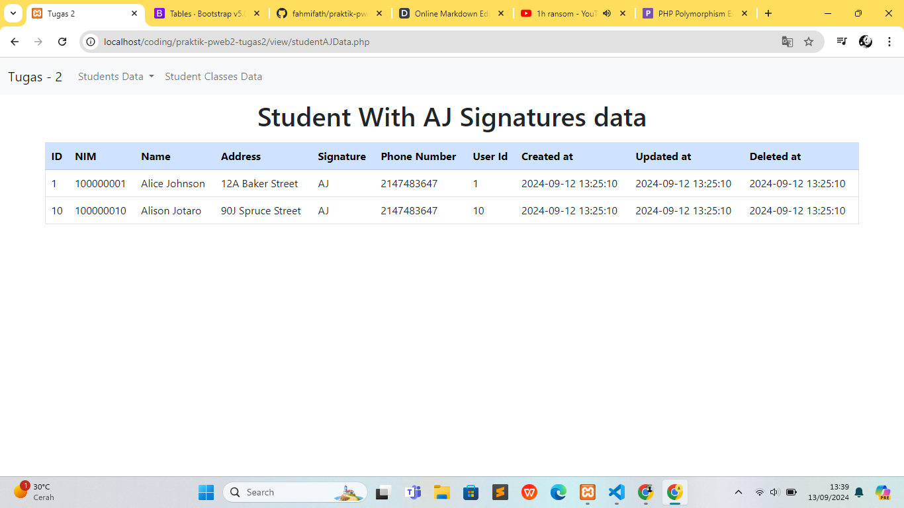
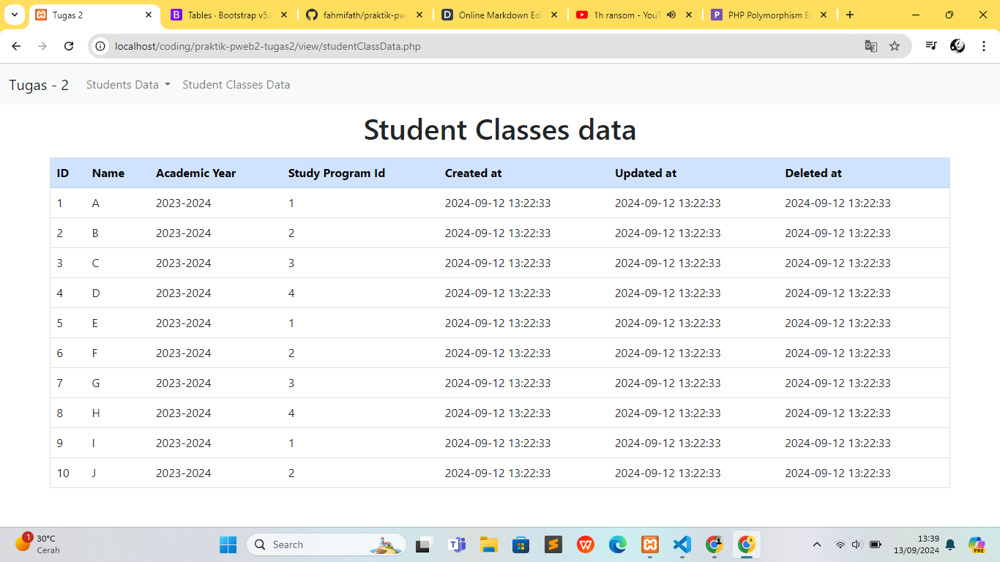
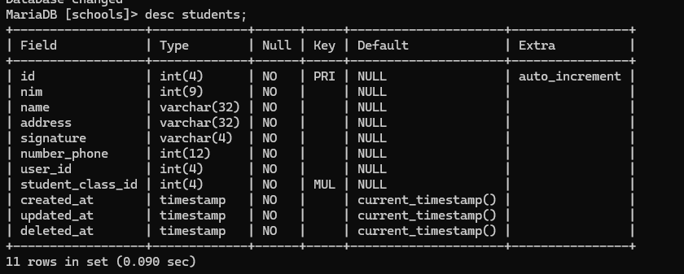
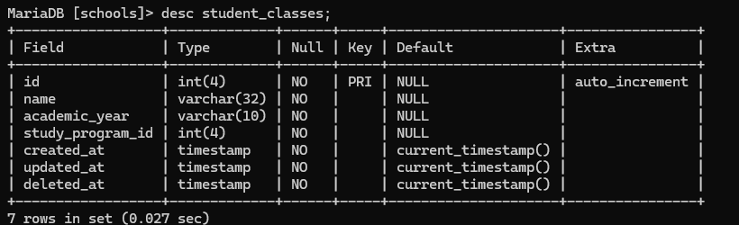

# Praktikum Pemrograman Web 2
Nama : Fahmi Fathurrohman

Kelas: TI 2B

NPM  : 230202034
## Tugas 2
## Penjelasan isi folder
### 1. Folder Layouts
berisi file file untuk memperbagus tampilan, file header.php dan footer.php untuk menyambungkan dengan bootstrap, dan file nav.php untuk navbar. 
### 2. Folder Library
berisi file func.php yang isinya class database untuk connect ke mySQL dan ada beberapa class yang merupakan turunan dari kelas database yang berisi method untuk menampilkan data.
### 3. Folder View
berisi file untuk menginstansiasikan class class yg ada di folder library dan menjalankan method untuk menampikan data.
## Penjelasan Setiap Task pada Tugas
#### Task 1: Create an OOP-based View, by retrieving data from the MySQL database
```sh
//class students yang merupakan turunan dari class Database
class Students extends Database {
    //method utk menampilkan data student
    public function showDataStudent() {
        //perintah untuk mengambil seluruh data dari tabel students
        $query = "SELECT * FROM students";
        //menjalankan perintah/query nya
        $result = mysqli_query($this->link, $query);
        $array = array();
        //memasukan data yang diambil ke dalam array
        while ($row = mysqli_fetch_array($result)) {
            $array[] = $row;
        }
        return $array;
    }
}
```
Membuat class beserta method yang berfungsi untuk menampilkan data berbasis paradigma OOP yang mengambil data dari database MySQL.
#### Task 2: Use the _construct as a link to the database
```sh
//class database
class Database {
    //property link, penerapan prinsip enkapsulasi
    protected $link;
    //method construct agar selalu terhubung ke database
    public function __construct() {
        $this->link = mysqli_connect('localhost', 'root', '', 'schools');
    }
}
```
Membuat method __construct di dalam class Database yang isinya perintah untuk selalu terconnect ke database yang dituju (di property $link) dan akan selalu dijalankan ketika class Database dan class child/turunannya menginstansiasikan objek baru.
#### Task 3: Apply encapsulation according to the logic of the case study
```sh
class Database {
    protected $link;
}
```
Salah satu konsep dari paradigma OOP yaitu enkapsulasi. Penerapannya dalam tugas kali ini yaitu adanya hak akses protected pada atribut $link yang artinya yang bisa mengakses atribut tersebut adalah class yang membuatnya dan class turunannya.
#### Task 4: Create a derived class using the concept of inheritance
```sh
//class parent
class Database {
    protected $link;
    public function __construct() {
        $this->link = mysqli_connect('localhost', 'root', '', 'schools');
    }
}

//class turunan
class Students extends Database {
    public function showDataStudent() {
        $query = "SELECT * FROM students";
        //atribut "$this->link" penerapan inheritance dr class induk
        $result = mysqli_query($this->link, $query);
        $array = array();
        while ($row = mysqli_fetch_array($result)) {
            $array[] = $row;
        }
        return $array;
    }
}
```
Dari code di atas terdapat penerapan salah satu dari konsep paradigma OOP yaitu Inheritance, yaitu di class Students (class turunan dari class Database) dapat mengakses atribut $link milik class indukan tanpa perlu membuat atribut baru.
#### Task 5: Apply polymorphism for at least 2 roles according to the case study
```sh
//class students
class Students extends Database
{
    //method utk menampilkan data student
    public function showDataStudent()
    {
        $query = "SELECT * FROM students";
        $result = mysqli_query($this->link, $query);
        $array = array();
        while ($row = mysqli_fetch_array($result)) {
            $array[] = $row;
        }
        return $array;
    }
}
//class student dg signature AJ
class StudentAJ extends Database
{
    //method utk menampilkan data
    public function showDataStudent()
    {
        $query = "SELECT * FROM students where signature = 'AJ'";
        $result = mysqli_query($this->link, $query);
        $array = array();
        while ($row = mysqli_fetch_array($result)) {
            $array[] = $row;
        }
        return $array;
    }
}
```
Penerapan konsep Polymorphism kali ini adalah adanya method showDataStudent(), di kedua class turunan diatas yang memiliki output berbeda.
```sh
//instansiasi class students
$students = new Students();
//menjaankan method untuk menampilkan seluruh data student
$studentsData = $students->showDataStudent();

//instansiasi class student dengan signature AJ
$studentAJ = new StudentAJ();
//menjaankan method untuk menampilkan data student dengan signature AJ
$studentAJData = $studentAJ->showDataStudent();
```
# Praktikum Pemrograman Web 2
Nama : Fahmi Fathurrohman

Kelas: TI 2B

NPM  : 230202034
## Tugas 2
## Penjelasan isi folder
### 1. Folder Layouts
berisi file file untuk memperbagus tampilan, file header.php dan footer.php untuk menyambungkan dengan bootstrap, dan file nav.php untuk navbar. 
### 2. Folder Library
berisi file func.php yang isinya class database untuk connect ke mySQL dan ada beberapa class yang merupakan turunan dari kelas database yang berisi method untuk menampilkan data.
### 3. Folder View
berisi file untuk menginstansiasikan class class yg ada di folder library dan menjalankan method untuk menampikan data.
## Penjelasan Setiap Task pada Tugas
#### Task 1: Create an OOP-based View, by retrieving data from the MySQL database
```sh
//class students yang merupakan turunan dari class Database
class Students extends Database {
    //method utk menampilkan data student
    public function showDataStudent() {
        //perintah untuk mengambil seluruh data dari tabel students
        $query = "SELECT * FROM students";
        //menjalankan perintah/query nya
        $result = mysqli_query($this->link, $query);
        $array = array();
        //memasukan data yang diambil ke dalam array
        while ($row = mysqli_fetch_array($result)) {
            $array[] = $row;
        }
        return $array;
    }
}
```
Membuat class beserta method yang berfungsi untuk menampilkan data berbasis paradigma OOP yang mengambil data dari database MySQL.
#### Task 2: Use the _construct as a link to the database
```sh
//class database
class Database {
    //property link, penerapan prinsip enkapsulasi
    protected $link;
    //method construct agar selalu terhubung ke database
    public function __construct() {
        $this->link = mysqli_connect('localhost', 'root', '', 'schools');
    }
}
```
Membuat method __construct di dalam class Database yang isinya perintah untuk selalu terconnect ke database yang dituju (di property $link) dan akan selalu dijalankan ketika class Database dan class child/turunannya menginstansiasikan objek baru.
#### Task 3: Apply encapsulation according to the logic of the case study
```sh
class Database {
    protected $link;
}
```
Salah satu konsep dari paradigma OOP yaitu enkapsulasi. Penerapannya dalam tugas kali ini yaitu adanya hak akses protected pada atribut $link yang artinya yang bisa mengakses atribut tersebut adalah class yang membuatnya dan class turunannya.
#### Task 4: Create a derived class using the concept of inheritance
```sh
//class parent
class Database {
    protected $link;
    public function __construct() {
        $this->link = mysqli_connect('localhost', 'root', '', 'schools');
    }
}

//class turunan
class Students extends Database {
    public function showDataStudent() {
        $query = "SELECT * FROM students";
        //atribut "$this->link" penerapan inheritance dr class induk
        $result = mysqli_query($this->link, $query);
        $array = array();
        while ($row = mysqli_fetch_array($result)) {
            $array[] = $row;
        }
        return $array;
    }
}
```
Dari code di atas terdapat penerapan salah satu dari konsep paradigma OOP yaitu Inheritance, yaitu di class Students (class turunan dari class Database) dapat mengakses atribut $link milik class indukan tanpa perlu membuat atribut baru.
#### Task 5: Apply polymorphism for at least 2 roles according to the case study
```sh
//class students
class Students extends Database
{
    //method utk menampilkan data student
    public function showDataStudent()
    {
        $query = "SELECT * FROM students";
        $result = mysqli_query($this->link, $query);
        $array = array();
        while ($row = mysqli_fetch_array($result)) {
            $array[] = $row;
        }
        return $array;
    }
}
//class student dg signature AJ
class StudentAJ extends Database
{
    //method utk menampilkan data
    public function showDataStudent()
    {
        $query = "SELECT * FROM students where signature = 'AJ'";
        $result = mysqli_query($this->link, $query);
        $array = array();
        while ($row = mysqli_fetch_array($result)) {
            $array[] = $row;
        }
        return $array;
    }
}
```
Penerapan konsep Polymorphism kali ini adalah adanya method showDataStudent(), di kedua class turunan diatas yang memiliki output berbeda.
```sh
//instansiasi class students
$students = new Students();
//menjaankan method untuk menampilkan seluruh data student
$studentsData = $students->showDataStudent();

//instansiasi class student dengan signature AJ
$studentAJ = new StudentAJ();
//menjaankan method untuk menampilkan data student dengan signature AJ
$studentAJData = $studentAJ->showDataStudent();
```
## Output Program
### 1. Halaman Index

### 2. Navbar Dropdown untuk memilih halaman

### 3. Data Students (opsi dropdown pertama)

### 4. Data Student dengan signature AJ (opsi dropdown kedua)

### 5. Data Student Classes

## Gambaran tabel di database
### 1. Tabel Students

### 2. Tabel Student data

